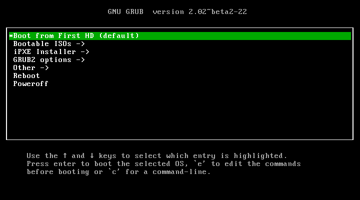

# Multiboot USB

## About

This repository stores the files needed to create a pendrive capable of booting different ISO files using GRUB2.

## Getting the files

### Using Git

If we have Git installed on the system, we can get the files directly from the repository:

```sh
git clone git://github.com/aguslr/multibootusb.git
```

After this, every time we want to update the files we do:

```sh
cd multibootusb && git pull
```

### Without Git

If Git is not installed, we can still get the files as long as we have a basic Unix environment available:

```sh
wget https://github.com/aguslr/multibootusb/tarball/master -O - | tar -xzv --strip-components 1 --exclude={README.md,demo.gif}
```

## Creating a bootable USB drive

Connect an USB drive with a FAT32 partition to your computer and mount the partition.

1. Create a directory named *boot* to store GRUB's configuration files, and a directory named *isos* to store ISO files:

   ```sh
   mkdir -p <mountpoint>/{boot/grub/grub.d/,isos}
   ```

   Where `<mountpoint>` is the directory where the USB drive is mounted. Use `mount` command to get this information.

2. Install GRUB on to the USB drive:

   ```sh
   sudo grub-install --force --no-floppy --boot-directory=<mountpoint>/boot <device>
   ```

   Where `<device>` is the name of the USB device (e.g. */dev/sdh*).

3. Copy the necessary GRUB files:

   ```sh
   cd multibootusb && cp -f grub.cfg <mountpoint>/boot/grub/ && cp grub.d/*.cfg <mountpoint>/boot/grub/grub.d/
   ```

4. Download and copy the ISO files into the USB drive:

   ```sh
   wget "http://cdimage.kali.org/kali-1.1.0/kali-linux-1.1.0-i386.iso" -P <mountpoint>/isos/
   ```

5. Reboot and select the USB drive to access the menu.

  
## Get bootable ISO files 

You can download from these websites:
* [**Clonezilla Live**](http://clonezilla.org/clonezilla-live.php): a small bootable GNU/Linux distribution for x86/amd64 (x86-64) based computers.
* [**Hiren's BootCD**](http://www.hirensbootcd.org/): a first aid kit for your computer.
* [**Kali Linux**](https://www.kali.org/): a Debian-derived Linux distribution designed for digital forensics and penetration testing.
* [**Parted Magic**](http://partedmagic.com/): a complete hard disk management solution.
* [**SystemRescueCd**](http://www.sysresccd.org/): a Linux system rescue disk for administrating or repairing your system and data after a crash.
* [**Tails**](https://tails.boum.org/): a live operating system, that aims at preserving your privacy and anonymity.

## Demo



## References

- [Using Syslinux and memdisk](https://wiki.archlinux.org/index.php/Multiboot_USB_drive#Using_Syslinux_and_memdisk)
- [Thermionix/multipass-usb](https://github.com/Thermionix/multipass-usb)
- [Transform a USB stick into a boot device packing multiple Linux distros](http://www.circuidipity.com/multi-boot-usb.html)
- [MultiBoot USB with Grub2 (boot directly from iso files)](http://www.panticz.de/MultiBootUSB)
- [Grub2 Loop Boot Solution](http://forums.kali.org/showthread.php?1025-Grub2-Loop-Boot-Solution)
