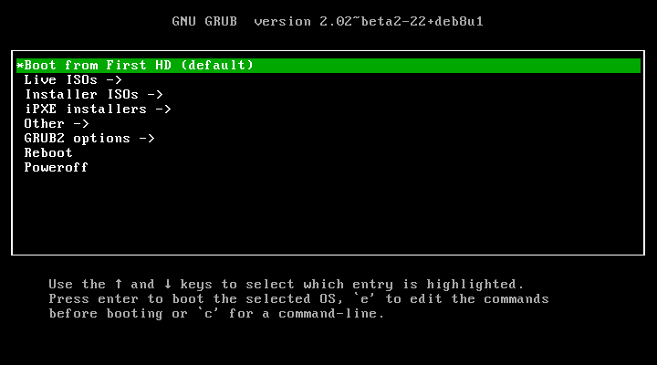

# Multiboot USB

<http://mbusb.aguslr.com/>

## About

This is a project that contains a collection of [GRUB][] files and scripts that will allow you to create a pendrive capable of booting [different ISO files][isos].

## Documentation

Visit the [project's website for more information][website].

[grub]: https://www.gnu.org/software/grub/
[isos]: http://mbusb.aguslr.com/isos.html
[website]: http://mbusb.aguslr.com/
